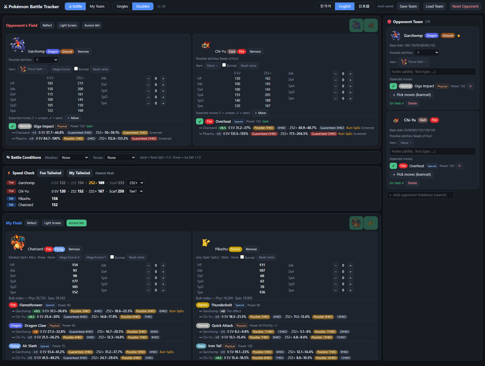
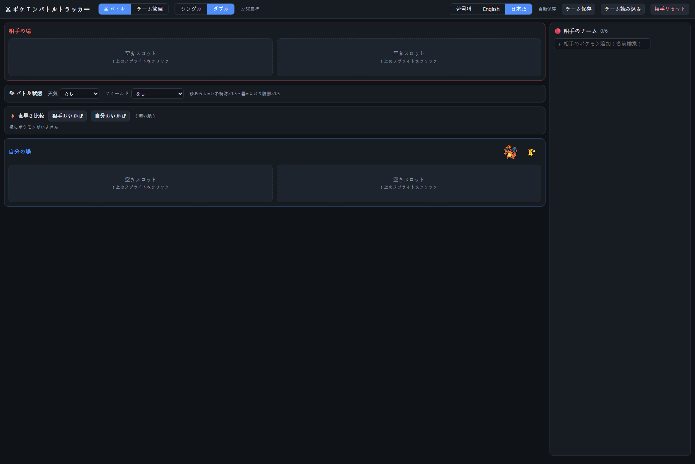
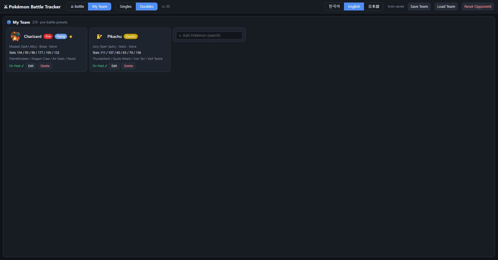

# Pokémon Battle Tracker

A zero-dependency, single-file battle companion for Lv. 50 Pokémon Championships-style play.
Open `battle_tracker.html` in a browser — no server, no install — and track both sides of a
battle in real time: live damage ranges, speed tiers, stat ranks, weather, terrain, and
opponent scouting, in **Korean, English, or Japanese**.



## Highlights

- **Runs from a double-click.** One HTML file plus one data file (`data.js`). No build step,
  no dependencies, works offline (sprites/item icons stream from the web when available).
- **Three languages, official names.** Switch between 한국어 / English / 日本語 at any time.
  All Pokémon (1,000+ species and forms), 900+ moves, abilities, items, natures, and types use
  the official localized names sourced from PokeAPI's game data — not machine translations.
  Search accepts any of the three languages regardless of the active UI language.
- **Built for the fog of war.** You don't know the opponent's spread, so every opponent stat
  and damage number is shown as two scenarios: **0 EV** (31 IV, no EVs, neutral nature) and
  **252+** (31 IV, 252 EVs, boosting nature). The truth is between them.
- **Championship rules.** Lv. 50, Mega Evolution supported as an in-battle toggle, no
  Terastal/Z-Moves/Dynamax, and a fixed 65-item competitive item list.



## Getting started

1. **Download** — clone the repo or grab the files (at minimum `battle_tracker.html` and
   `data.js` must sit in the same folder):

   ```
   git clone https://github.com/charlestw127/pokemon-battle-tracker.git
   ```

2. **Open `battle_tracker.html`** in any modern browser (Chrome, Edge, Firefox, Safari).

3. **Pick your language** with the 한국어 / English / 日本語 buttons in the header. The choice
   is remembered.

4. **Build your team** in the *My Team* tab, then run battles from the *Battle* tab.
   Everything auto-saves to your browser's local storage as you go.

## How to use

### 1. Set up your team (My Team tab)



- **Add a Pokémon** by typing its name (in Korean, English, or Japanese) into the search box —
  up to 6 team members.
- Click **Edit** on a card to set:
  - **Nature** — shown with its stat effect, e.g. *Modest (SpA↑ Atk↓)*
  - **Ability** — chosen from the species' real ability list
  - **Item** — from the championship item list, with effect summaries
  - **IVs / EVs** — the EV total is validated against the 508 cap
  - **Moves (max 4)** — the search only offers moves that species can actually learn
- Stats are computed at Lv. 50 from base stats, IVs, EVs, and nature, and each card shows a
  physical/special **bulk index** so you can compare defensive presets at a glance.
- Mega-capable Pokémon are marked with ◆ — add the base form here and Mega Evolve during battle.

### 2. Scout the opponent (right panel)

- **Add opponent Pokémon** as they are revealed (name search, any language) — up to 6.
- Each opponent card shows **base stats**, an **ability** picker, and an **item** picker.
  Species with a single possible ability (Xerneas, the Ruin quartet, …) are treated as
  confirmed automatically; for everything else, pick the ability once it's revealed.
- **Expected moves:** open *Pick moves* to browse everything that species can learn (sorted by
  power) and tag the moves you expect. Each move has a **? / ✔ toggle**:
  - `?` *Unseen* — your guess, rendered dimmed
  - `✔` *Seen* — confirmed in battle
- A free-text **notes** field per Pokémon holds anything else (revealed ability, tera type in
  other formats, habits…).

### 3. Run the battle (Battle tab)

- Choose **Singles** or **Doubles** — the field shows 1 or 2 slots per side.
- Click a **bench sprite** to send that Pokémon onto the field; **Remove** takes it back.
- On-field controls for each Pokémon:
  - **Stat ranks** (−6…+6) for Atk/Def/SpA/SpD/Spe, with the modified stat shown live
  - **Burned** checkbox (halves physical damage)
  - **Mega Evolve / Primal Reversion** toggle — swaps stats, typing, and ability instantly
  - **Reset ranks** for when a Pokémon switches out
- **Battle conditions bar:** weather (Sun / Rain / Sandstorm / Snow) and terrain (Electric /
  Grassy / Psychic / Misty), plus per-side **Tailwind** toggles in the speed panel.
- **Walls:** per-side **Reflect / Light Screen / Aurora Veil** toggles in each field header —
  ×0.5 damage in singles, ×2/3 in doubles, applied to the correct move category.

### 4. Read the numbers

**Damage lines.** Under each of your moves you get damage vs. every fielded opponent — and
under each *expected* opponent move, damage vs. your fielded Pokémon:

```
→ Charizard  ×1   0 EV 56.5~66.9%  Guaranteed 2HKO  ·  252+ 74.7~88.3%  Guaranteed 2HKO
```

- Damage is shown as **% of the target's HP** for both the 0 EV and 252+ scenarios, with
  **KO labels** (*Guaranteed OHKO*, *Possible 2HKO*, …).
- The calculation includes: STAB, type effectiveness, spread-move 0.75 in doubles, weather
  (×1.5/×0.5), terrain boosts and halvings (including Grassy Terrain halving Earthquake and
  Misty Terrain halving Dragon moves for grounded targets), burn, walls, sandstorm Rock SpD
  ×1.5, snow Ice Def ×1.5, and item modifiers on **both sides** — Life Orb, Expert Belt,
  Muscle Band, Wise Glasses, type-boost items (×1.2), super-effective-halving berries (and
  Chilan Berry), Light Ball, and Iron Ball's grounding effect.
- **Field-wide abilities are applied automatically** for anyone on the field:
  - **Fairy Aura / Dark Aura** — ×1.33 on Fairy/Dark moves from *any* Pokémon, flipped to
    ×0.75 by **Aura Break**
  - **Tablets of Ruin / Sword of Ruin / Vessel of Ruin / Beads of Ruin** — ×0.75 to the
    Atk / Def / SpA / SpD of every other Pokémon, with holders of the same ability immune
  - **Steely Spirit** — ×1.5 on Steel moves from the holder's side
- Badges (`Weather↑`, `Power↑`, `Ruin SpD↓`, `Screened`, `Berry halved`, …) flag exactly
  which conditions changed a number.

**Speed Check panel.** Everyone on the field, sorted fastest-first:

- Your Pokémon show their real (rank/item/Tailwind-adjusted) speed.
- Opponents show **four tiers at once**: `0 EV · 252 · 252+ · Scarf`. Once turn order reveals
  which tier the opponent is actually in, pin it with the dropdown and the sort uses that value.

### 5. Between matches

- **Reset Opponent** clears the opponent team, field, ranks, weather, and terrain — your team
  stays. One click and you're ready for the next opponent.
- **Save Team / Load Team** exports/imports `my_team.json`, so teams survive browser data
  wipes and can be shared between machines. Dropping a `my_team.json` next to
  `build_data.py` also bakes it in as the default team on the next data build.

## Feature reference

| Area | Features |
|---|---|
| Languages | Korean / English / Japanese UI; official localized names for Pokémon, forms, moves, abilities, items, natures, types; cross-language search |
| Formats | Singles & Doubles, Lv. 50, Mega Evolution & Primal Reversion, fixed championship item list |
| My team | 6 slots, nature/ability/item editor, IV/EV editor with 508 cap check, learnset-limited move picker, Lv. 50 stats, bulk index |
| Opponent | 6 slots, 0 EV vs 252+ stat ranges, ability picker (auto for single-ability species), item picker, expected moves from real learnsets, seen/unseen tracking, notes, speed-tier pinning |
| Battle | Per-slot stat ranks, burn, in-field Mega toggle, weather, terrain, Tailwind per side, Reflect/Light Screen/Aurora Veil per side, bench quick-swap |
| Damage | Two-scenario % ranges, KO labels, STAB/type/spread/weather/terrain/burn/wall/item modifiers, auto-applied Auras & Ruin abilities & Steely Spirit, immunity handling (incl. Iron Ball vs. Ground) |
| Persistence | Auto-save (localStorage), JSON team export/import, one-click opponent reset |

### Known simplifications

Only field-wide abilities (Fairy/Dark Aura, Aura Break, the four Ruin abilities, Steely
Spirit) affect the damage math — other abilities (Levitate, Intimidate, Multiscale…) are
tracked as notes only. Infiltrator's screen bypass, critical hits, accuracy, and multi-hit
distributions aren't modeled. Opponent IVs are assumed to be 31.

## Rebuilding the data (`data.js`)

`data.js` ships pre-built. Rebuild it only when you want fresh game data (new Pokémon, moves,
or name corrections):

```
python build_data.py
```

Requires Python 3.8+ and an internet connection (`beautifulsoup4` is optional — there's a
regex fallback). The script:

1. Reads `pokedex.json` (species, forms, base stats, Korean/English names)
2. Scrapes current typings from pokemondb.net
3. Pulls moves, learnsets, abilities, and official KO/EN/JA names from PokeAPI's CSV data
4. Matches sprites and ability sets against Pokémon Showdown's dex
5. Resolves the championship item list to verified icon URLs
6. Writes everything to `data.js`, embedding `my_team.json` as the default team if present

It verifies its own output (sprite spot-checks, item icon checks, translation coverage) and
prints warnings for anything unresolved.

## Project layout

| File | Role |
|---|---|
| `battle_tracker.html` | The entire app — markup, styles, logic, i18n strings |
| `data.js` | Generated game database (Pokémon, moves, items, type chart, translations) |
| `build_data.py` | Regenerates `data.js` from public data sources |
| `pokedex.json` | Base stats + KO/EN names input used by the build script |
| `my_team.json` | Your exported team; also seeds the default team at build time |
| `docs/` | README screenshots |

## Data sources & credits

- [PokeAPI](https://github.com/PokeAPI/pokeapi) — moves, items, abilities, natures, and all
  official Korean/English/Japanese names
- [Pokémon Showdown](https://play.pokemonshowdown.com) — sprites, learnsets, ability sets
- [Pokémon Database](https://pokemondb.net) — current type assignments per form
- Item icons: Pokémon Showdown / PokeAPI sprites / Serebii

This is an unofficial, non-commercial fan tool. Pokémon and all related names and images are
© Nintendo, Creatures Inc., GAME FREAK inc., and The Pokémon Company. This project is not
affiliated with or endorsed by them.
